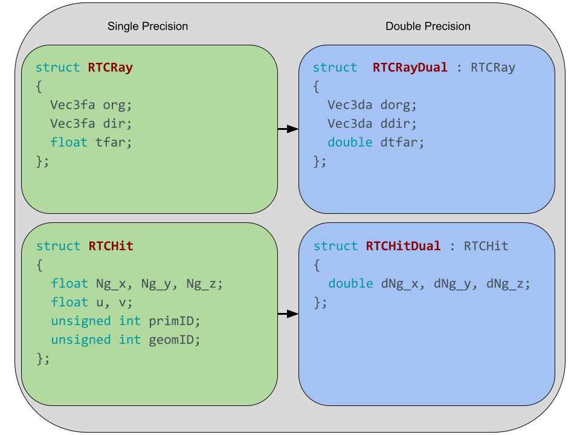

.. _methodology_implementation:

==========================================================
Implementation of Mixed Precision Ray Tracing with Embree
==========================================================

To apply the mixed-precision approach with Embree, custom definitions of both
the underlying geometry primitives and ray definitions are required. First,
user-defined double precision primitives are generated with the triangles from
the Mesh Oriented datABase (`MOAB`_). With the understanding that the values of
the bounding boxes for each primitive would be interpreted by Embree in single
precision, the bounds are artificially extended enough to ensure that any
ray-box intersection that would have occurred in double precision would also
occur in single precision, but not enough to degrade performance of the BVH
traversal due to large overlaps of sibling bounding boxes. An :math:`\epsilon`
of 0.005 is sufficient to ensure robust ray intersections without significantly
impacting performance for models typically analyzed in Monte Carlo radiation
transport problems, the application for which this tool is designed.

.. _ray_dual:

.. _MOAB: https://sigma.mcs.anl.gov/moab-library/