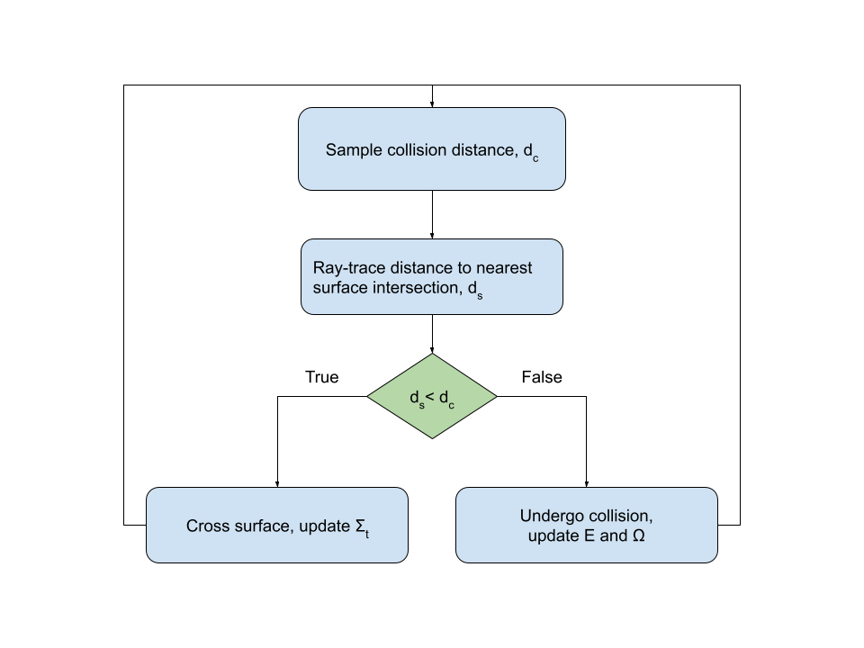
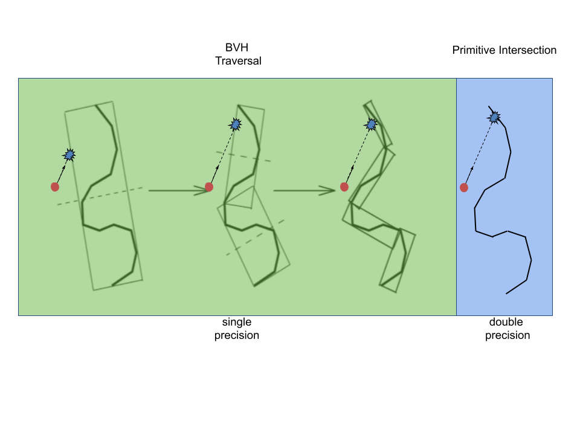

.. _methodology_introduction:

============
Introduction
============

Ray tracing is the process of determining the ray intersection (or set of
intersections) with objects along the ray's direction, starting from some point
of origin.

==========================
Motivation for Double-Down
==========================

Ray tracing commonly used in visualization and rendering to produce high-quality
images of objects, scenes and/or data. This process is relatively costly
compared to other visualization techniques, however. As a result, significant
research and development has gone into optimizing ray tracing algorithms and
data structures.

Ray tracing is often necessary in scientific applications as well, but
constraints on precision and speed differ when considering distances to
intersection in simulation versus visualization.

For example, ray tracing is used in Monte Carlo simulations of radiation to
track individual particles as they move from object to object in the model. As
described in mcrt_flowchart_, both a distance to collision (treated as if
the current medium is infinitely large) and distance to nearest surface crossing
are considered.

.. _mcrt_flowchart:

If the distance to the collision site is smaller than the distance to the
surface crossing, the particle undergoes a collision and it's properties are
updated accordingly. If the distance to the nearest surface along the particle's
trajectory is smaller than the collision distance, the particle will cross the
surface and enter the region on the other side.

Computation of the nearest surface crossing requires a ray to be traced to the
boundary of the current region. While these models have historically been
represented using Constructive Solid Geometry (CSG), more complex models rely on
CAD-based tessellations of analytic surfaces. For these tesellated surfaces
composed of triangle primitives, ray tracing operations in single precision with
particle properties represented in double precision (location and direction)
cause problems in tracking algorithms resulting in a decoupling of the
particle's logical position (what region it resides in) from it's numerical
position (see shriwise_2015_ans_). These issues can cause a loss of
statistics that bias results of the simulation.

To address these issues, the process of BVH traversal is separated from
primitive intersection at the leaf nodes of the hierarchy. Given that the
majority of computational operations in a ray fire are spent traversing the BVH,
performing these operations in single precision has a high impact on
performance. When candidate primitives are reached at the leaf nodes of the BVH,
primitive intersection routines can still be performed in double precision (as
depicted in mixed_precision_traversal_). Thus the ray tracing kernel can
greatly benefit from performing most operations in single precision while
returning the same numerical result from the ray fire query in double precision.

.. _mixed_precision_traversal:

The metric used here for a robust approach is that the nearest intersected
primitive and distance returned from the ray fire is the same using the mixed
precision approach as in the double precision case. This is possible so long as
the set of BVH nodes with positive ray-box intersections in single precision
contains the set of nodes with positive intersection checks in double precision.
To ensure that this is true, single precision bounding boxes are extended by
some value :math:`\epsilon`. The artificial expansion of these boxes is kept to
a minimum, only set large enough to maintain robustness in the kernel, to avoid
increasing the overlap of sibling bounding boxes and superfluous intersection
checks --- a known issue that can degrade the performance of BVH traversal.
Verification of this approach can be found in shriwise_2018_ans_.

.. _shriwise_2015_ans: https://epubs.ans.org/?a=37943
.. _shriwise_2018_ans: https://epubs.ans.org/?a=44301
